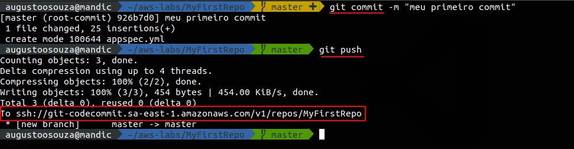
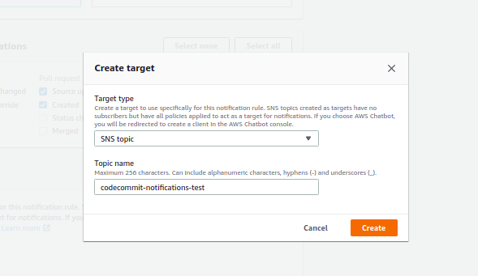

# Lab 01 - CodeCommit
Criando meu primeiro repositório no CodeCommit 

# 1. Criando Repositório via AWS Console

Primeiro vamos aprender como criar o repositório via AWS Console.

1.1 Em CodeCommit (https://console.aws.amazon.com/codesuite/codecommit/start?region=us-east-1#), clicar em create repository. 
feito isso, conforme imagem abaixo, colocar um nome e uma descrição(opicional) para seu novo repositorio e clicar em create.

1.2 Após criado, o proximo passo é subir seu codigo para o repositório. Exitem dois metodos, ou clonando o repositorio. (para isso é necessario ter o git instalado em seu pc) ou através do "add files" na propria console.

1.3 Para clonar existem dois metodos, via HTTPS ou SSH. Para exemplificar aqui, vou utilizar o metodo HTTPS, porem, se você já tem o AWSCLI configurado, usando SSH não será necessário digitar usuario e senha tanto para clonar, quando para pull e push. 

1.4 Primeiro vamos criar um usuario com as permissões necessarias. Neste caso ja adicionei todas as permissões necessarias para o os labs de Continous Integration.

1.5 Criado usuario, voltar na console do IAM, e gerar as credenciais para HTTPS Codecommit. Salve o seu CSV.

1.6 Agora com as credenciais, vamos lá clonar nosso repositório.

# 2. Criando Repositório via AWS CLI

2.1 Agora, vamos criar nosso repositório utilzando o CLI. Basta digitar conforme abaixo:
~~~
$ aws codecommit create-repository --repository-name MyFirstRepo --repository-description "Meu primeiro Repositorio AWS"
~~~
2.2 Feito isso, a saida deverá ser um JSON com o metadado do repositorio

2.3 Basta agora compiar a url fornecida no JSON ou para clonar usando SSH ou HTTP e realizar igual no exemplo anterior.

# 3. Subindo meu primeiro codigo para o CodeCommit usando git add, commit e push.

3.1 Vamos começar com o commando add. Para isso, vamos criar um primeiro codigo em nosso repositório. Para exemplo, estou usando o arquivo appspec.yml

**Notem que, minha branch está agora na cor amarela, isto acontece para informar que há uma mudança no estado da branch. Agora vamos usar o comando "git status" para checar as alterações e "git add" para confirmar o novo arquivo.

3.1 codigo adicionado, vamos agora "commitar" com "git commit" e empurrar pra dentro do CodeCommit.

3.2 Agora vamos acessar o CodeCommit via console e verificar nossa alteração. E pronto nosso codigo já está no Repositorio.

# 4. Criando branchs e pull requests no CodeCommit

4.1 Para criar uma branch via usando git
~~~
$ git checkout -b developer
$ git push --set-upstream origin developer
~~~

4.2 para criar uma branch via console, bastar no menu da esquerda e clicar em branch, depois "Create Branch", selecionar a branch from, neste caso a master, e create. A saida deverá ser semelhante a esta.

4.2 Agora altere o arquivo appspec.yml na branch develop e commit a alteração. Neste momento a branch master está desatualizada comparada a branch develop, por isso precisamos fazer um merge. No CodeCommit fazemos isso através do pull request.

4.3 Clique em "pull request" na tela seguinte ira aparece Destination e source. Mantemos a master como destino e selecionamos a origem como a develop e climaos em "compare". Não havendo conflito entre as branchs, de um titulo para o merge e clicar em pull request.

4.4 Depois, clicar em merge pull request (Confirmar se voce quer realmente excluir a branch de origem).

# 5. Protejendo Branchs e Repositorios

5.1 Primeiro criar um grupo por exemplo "desenvolvedores-junior". Para isso vamos em IAM>Groups>ADD Groups ou via CLI.

~~~
$ aws iam create-group --group-name "desenvolvedores-junior"
~~~

Depois Adicionar o desenvolvedor ao grupo

~~~
aws iam add-user-to-group --user-name augustosouzalabs --group-name desenvolvedores-junior
~~~

5.2 Vamos atachar a politica ao grupo conforme documentação (https://docs.aws.amazon.com/codecommit/latest/userguide/how-to-conditional-branch.html).

~~~JSON
{
    "Version": "2012-10-17",
    "Statement": [
        {
            "Effect": "Deny",
            "Action": [
                "codecommit:GitPush",
                "codecommit:DeleteBranch",
                "codecommit:PutFile",
                "codecommit:MergeBranchesByFastForward",
                "codecommit:MergeBranchesBySquash",
                "codecommit:MergeBranchesByThreeWay",
                "codecommit:MergePullRequestByFastForward",
                "codecommit:MergePullRequestBySquash",
                "codecommit:MergePullRequestByThreeWay"
            ],
            "Resource": "arn:aws:codecommit:*:*:*",
            "Condition": {
                "StringEqualsIfExists": {
                    "codecommit:References": [
                        "refs/heads/master" 
                     ]
                },
                "Null": {
                    "codecommit:References": false
                }
            }
        }
    ]
}
~~~
# 6. Notificação e Triggers com CodeCommit

6.1 Acessar o Repositorio e ir em Settings.

6.2 Adicionar um nome para a rule, selecionar os eventos do gatilho e em SNS clicar em "create target"

6.3 Crear um topic name e clicar em create

6.4 Feito isso, clicar Submit para criar a notificação.

6.5 Agora, vamos criar uma Trigger. Vá novamente em Settings, e click na aba Trigger. Em trigger, seguir modelo

6.6 Agora Vamos em CloudWatch e Clicar em Events >Rules e então Create Rule

6.7 Agora vamos escolher o serviço, o tipo de evento e adicionar o target SNS que criamos, clicar em configure details, dar um para a rule e pronto.

# 7. CodeCommit lambda

7.1 Agora vamos criar uma lambda notification. Vamos navegar até o dashboard da Lambda e "create function"

7.2 Vamos criar uma lambda em python2.7. conforme abaixo.

7.3 Feito isso, vamos criar a trigger do CodeCommit.

7.4 Agora, seguindo a documentação da AWS(https://docs.aws.amazon.com/codecommit/latest/userguide/how-to-notify-lambda.html), vamos pegar esse codigo python de exemplo.

~~~python
import json
import boto3

codecommit = boto3.client('codecommit')

def lambda_handler(event, context):
    #Log the updated references from the event
    references = { reference['ref'] for reference in event['Records'][0]['codecommit']['references'] }
    print("References: "  + str(references))
    
    #Get the repository from the event and show its git clone URL
    repository = event['Records'][0]['eventSourceARN'].split(':')[5]
    try:
        response = codecommit.get_repository(repositoryName=repository)
        print("Clone URL: " +response['repositoryMetadata']['cloneUrlHttp'])
        return response['repositoryMetadata']['cloneUrlHttp']
    except Exception as e:
        print(e)
        print('Error getting repository {}. Make sure it exists and that your repository is in the same region as this function.'.format(repository))
        raise e
~~~
7.5 Feito isso vamos salva a função e testar. 

Documentação referencia:

https://docs.aws.amazon.com/codecommit/latest/userguide/auth-and-access-control-iam-identity-based-access-control.html

https://aws.amazon.com/blogs/devops/refining-access-to-branches-in-aws-codecommit/

https://docs.aws.amazon.com/codecommit/latest/userguide/how-to-notify.html

https://docs.aws.amazon.com/codecommit/latest/userguide/how-to-repository-email.html 

https://docs.aws.amazon.com/codecommit/latest/userguide/how-to-notify-lambda.html

https://docs.aws.amazon.com/codecommit/latest/userguide/how-to-migrate-repository-existing.html