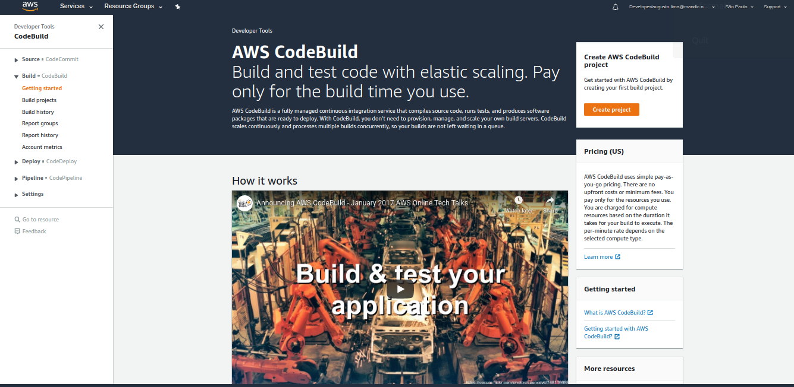
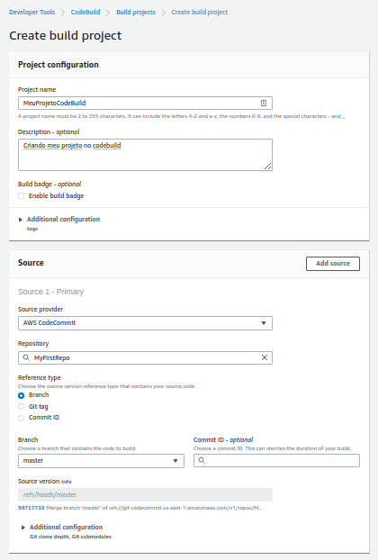
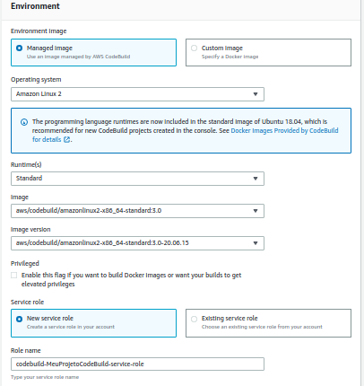
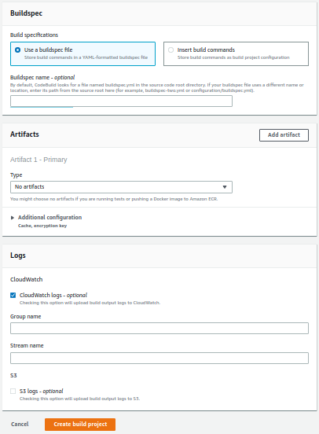
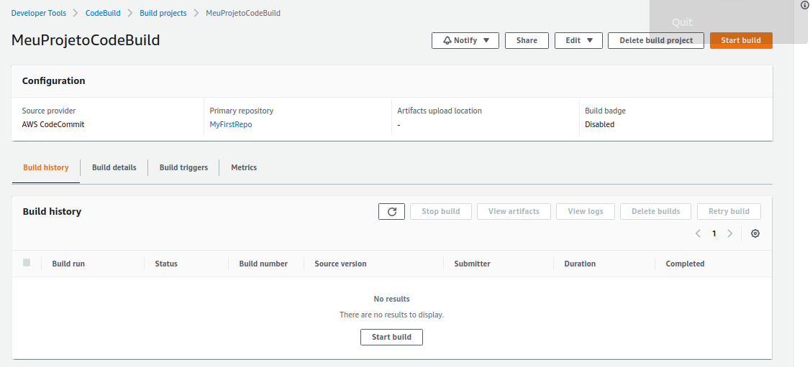
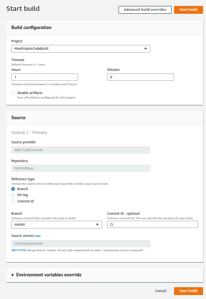
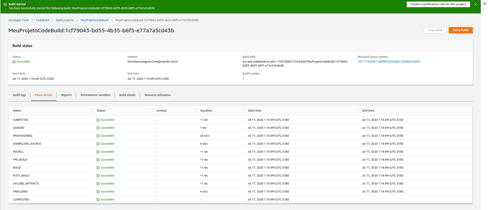
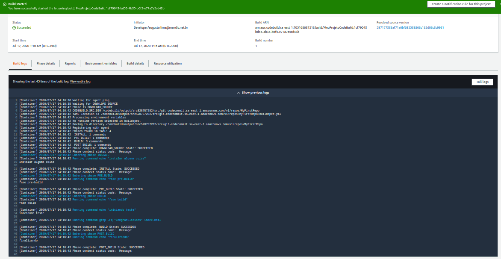
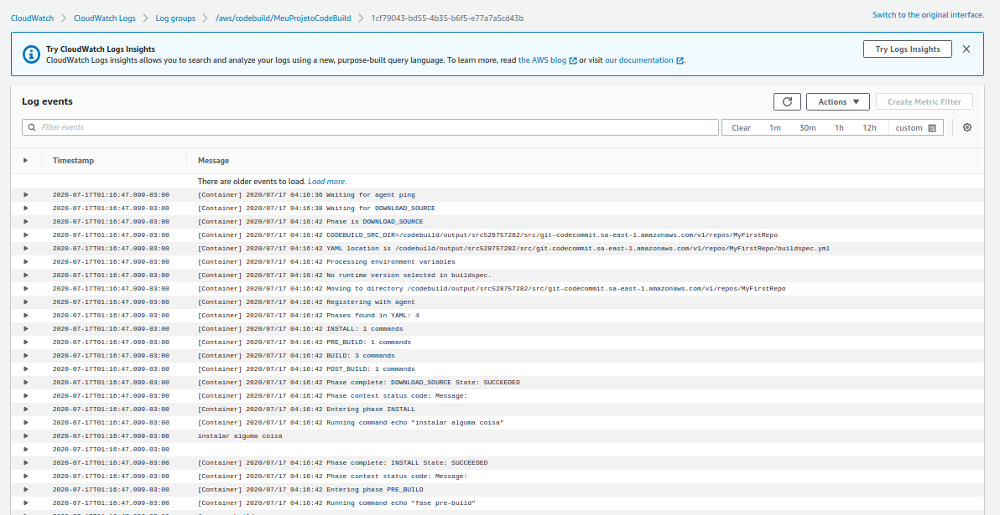
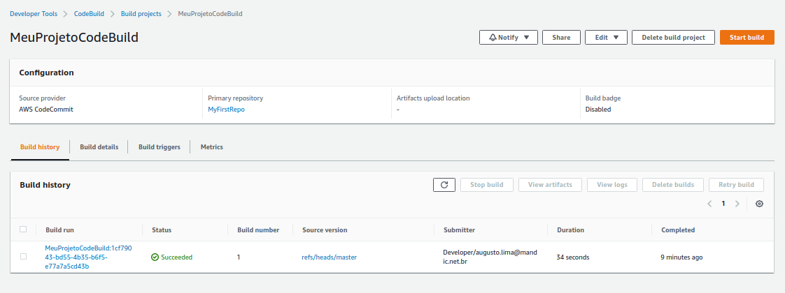

# Lab 02 - CodeBuild
Realizando testes da aplicação usando AWS CodeBuild

# 1. Criando Build Projecy

1.1 Em CodeBuild (https://sa-east-1.console.aws.amazon.com/codesuite/codebuild/start?region=sa-east-1), clicar em create Project. 

1.2 Primeiro vamos dar um nome para nosso projeto e escolher qual o source provider da nossa aplicação. Neste caso é o CodeCommit (MyFirstRepo), mas o CodeBuild aceita como source: BitBucket, GitHub, S3 e GitHub Enterprise.
Tambem será perguntado qual a referencia para o build. Neste lab vamos escolher Branch - Master, mas poderiamos escolher uma TAG no caso de testar uma versão especifica do codigo ou um commitID especifico.

1.3 Agora, devemos escolher o ambiente para o build. A imagem poderá ser uma imagem padrão da AWS ou podemos usar uma imagem docker customizada, para laboratorio, vamos usar a imagem default amazon Linux. Vamos usar tambem o Runtime e imagem mais recente.
Para executar o CodeBuild, é necessario uma role IAM especifica, o CodeBuild poderá criar para voce caso não tenha uma, basta nomea-la.
*Não vamos mexer com configurações adicionais no momento.

1.4 Em Buildspec, é onde definimos as fases de teste do codigo. Neste caso eu já criei um builspec e subi para nosso repositorio. Mas o CodeBuild permite voce inserir os comando manualmente disponibilizando um editor.
Artifacts não iremos usar nesse lab. O CodeBuild permite armazenar o artefato no S3. Logs vamos manter no CloudWatch padrão, mas tambem é possivel usar o S3 para facilitar o debug. 
Finalizado, clicamos em Create Build Project.

1.5 Projeto criado, agora vamos clicar em "Start Build".

Novamente irá aparecer as configurações do build. As unicas opções disponiveis para serem alteradas são a Referencia e adicionar uma variavel. Não vamos alterar nada e clicar em "start build"

1.6 Nosso container para build foi inializado, com isso conseguimos acompanhar o log, as fases do build, etc. 

Tambem é possivel visualizar o log completo no cloudwatch, clicando em "view intire log". Assim facilitar o debug.

Todos os builds ficarão disponiveis em Build History com as informações do build. 

documentação referencia:

https://docs.aws.amazon.com/codebuild/latest/userguide/build-spec-ref.html

https://docs.aws.amazon.com/codebuild/latest/userguide/samples.html