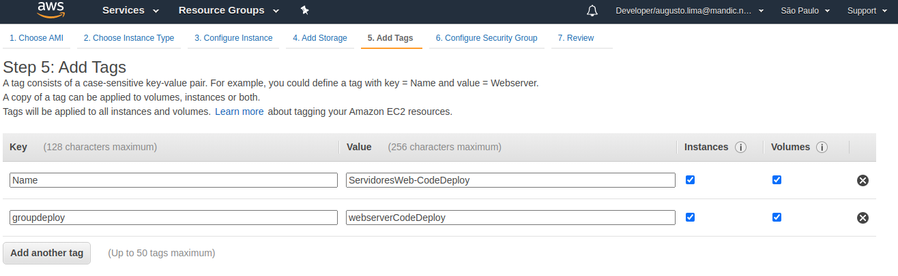

# Lab 03 - CodeDeploy
Realizando o Deploy das aplicações usando AWS CodeDeploy 

### 1. Usando CodeDeploy com Instancias EC2.

1.1 Primeiro passo, criar uma instancia EC2. Para agilizar o processo, utlizarei um user-data para instalar o CodeDeploy e suas dependencias + Apache para teste da nossa aplicação.

~~~bash
!/bin/bash
yum update -y
yum install ruby -y
wget https://aws-codedeploy-us-west-2.s3.us-west-2.amazonaws.com/latest/install
chmod +x ./install
./install auto
service codedeploy-agent start
yum install httpd -y
service httpd start
chkconfig httpd on
~~~
obs: Para baixar o **codedeploy-agent** para a sua região especifica. consultar o nome do bucket disponivel em: (https://docs.aws.amazon.com/pt_br/codedeploy/latest/userguide/resource-kit.html#resource-kit-bucket-names)

1.2 O code deploy se baseia em **Target Groups** para realizar o deploy da aplicação. Ou seja precisamos criar um grupo de tag para nossos servidores web conforme abaixo:

1.3  Após criado as instancias, vamos criar nossa aplicação no CodeDeploy. Primeiro passo, dar um nome para a aplicação e escolher **ec2/onpremises** e clicar em **Create Application**

Agora vamos em **create deployment group** 

1.4 Primeiro passo, é dar um nome para o Deployment Group, e definir qual é a AIM role que será utizada (necessário criar uma role especifica para o codedeploy).
Neste primeiro Exemplo vamos utilizar o metodo de deploy **In-Place**.

1.5 Em Environment Configuration, escolher Amazon EC2 Intances e Escolher o TagGroup definido na criação da instancia.

1.6 Em agent configuration, vamos manter o padrão. Deployment Setting, escolher qual tipo de deploy. Neste exemplo estou utilizando "AllAtOnce", atualizando as instancias ao mesmo tempo. Feito isso clicar em "Create"

### 2. CodeDeploy utilizando Github

2.1 Agora vamos criar o Deployment. Neste primeiro exemplo vamos utilizar o GitHub para empurrar o codigo para o deploy. Vamos clicar em **create Deployment"

2.2 Em Create Deployment >Revision Type, vamos selicionar **My app stored in Github**. Para isso no seu repositorio, copiar o token do commit ao qual você irá fazer o deploy. Clicar em Connect, então, o CodeDeploy irá pedir permissão de acesso ao seu repositorio Github. Clicar em Authorize e digitar sua senha do github.

O codigo exemplo pode ser encontrado em (https://github.com/augustosoouza/Codedeploy-labs)

2.3 Autorizado acesso ao github, a saida será semelhante abaixo. Então só configurar o nome do repositorio e o id do commit novamente. Nos demais passos manter o padrão e clicar em create.

2.4 Ao clicar em create, será inicializado uma tentativa de deploy. Ao concluir deverá aparecer em status Succeeded

### 3. CodeDeploy utilizando Bucket S3

3.1 Neste exemplo, agora vamos utilizar um bucket S3 para empurrar o codigo para o deploy. Primeiro passo é criar um bucket S3 com permissão de versionamento e depois compactar o codigo usando para empurrar para o bucket.

pré-requisito: Criar uma role com a Police S3ReadOnlyAcess e anexar a sua EC2.

Criar bucket e habilitar o versionamento
~~~sh
$ aws s3 mb s3://aws-devopsengineer-labs --region us-west-2 --profile <profile-name>

$ aws s3api put-bucket-versioning --bucket aws-devopsengineer-labs --versioning-configuration Status=Enabled --region us-west-2
~~~

Deploy Codigo para S3 compactado
~~~sh
$ aws deploy push \
  --application-name Webserver-Devopslabs \
  --description "Deploy via S3 para Webserver-Devopslabs" \
  --ignore-hidden-files \
  --s3-location s3://aws-devopsengineer-labs/application.zip \
  --region us-west-2
~~~

3.2 feito isso, no seu s3 deverá ter um bucket com o nome especificado e o arquivo descrito no deploy e em propriedades o versionanemento estará habilitado.

3.3 Agora voltando em CodeDeploy, vamos criar um novo deployment usando agora o S3. Vamos usar o mesmo deployment group. Clicar em Create Deployment.

3.4 Após criado, o deploy será iniciado e você terá uma saida semelhante abaixo

Documentação referencia:

https://docs.aws.amazon.com/codedeploy/latest/APIReference/API_MinimumHealthyHosts.html

https://docs.aws.amazon.com/codedeploy/latest/userguide/reference-appspec-file-structure-hooks.html

https://docs.aws.amazon.com/codedeploy/latest/userguide/reference-appspec-file-structure-hooks.html#appspec-hooks-server

https://docs.amazonaws.cn/en_us/codedeploy/latest/userguide/reference-appspec-file-structure-hooks.html#reference-appspec-file-structure-environment-variable-availability