# Lab 04 - CodePipeline
Criando uma pipeline de desenvolvimento usando CodePipeline 

### 1. Criando Pipeline com CodePipeline

Obs: Para este laboratorio será necessario utilizar os recursos criados no codecommit, codebuild e codedeploy. Caso tenha removido, será preciso cria-los novamente.

1.1 Primeiro vamos acessar o CodePipeline. Clicar em Create pipeline

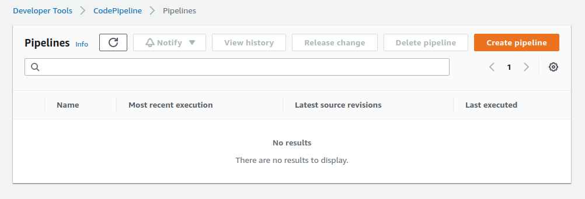

1.2 Precisamos dar um nome para a pipeline e adicionar a service role que permitirá a pipeline funcionar. Neste exemplo iremos permitir o CodePipiline criar uma service role.

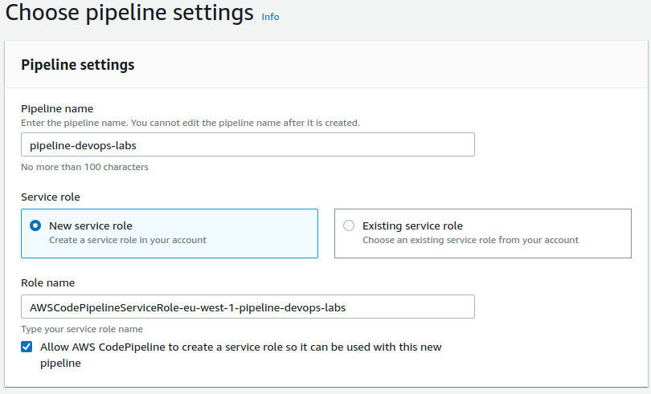

1.3 Em Advanced Settings, vamos escolher o bucket criado anteriormente. Tambem é possivel deixar o codepipeline criar um bucket. Clicar em next.

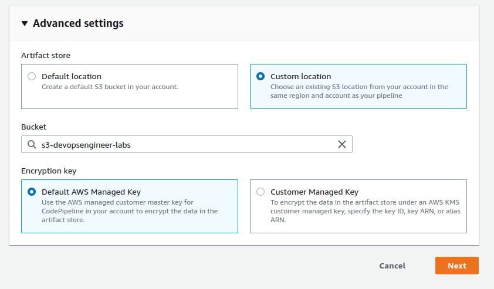

1.4 Em source provider escolher AWS CodeCommit e selecionar o repositorio criado anteriormente e a branch qye vamos usar. Clicar em Next

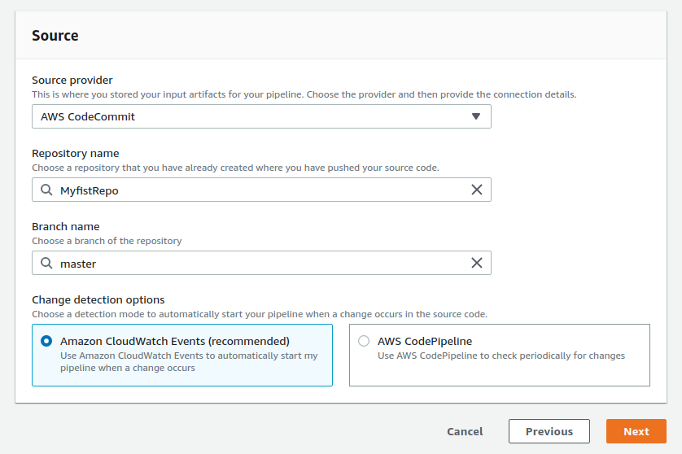

1.5 Em Build Stage (Opcional), escolhemos o build que criamos usando AWS CodeBuild. Clicar em Next.

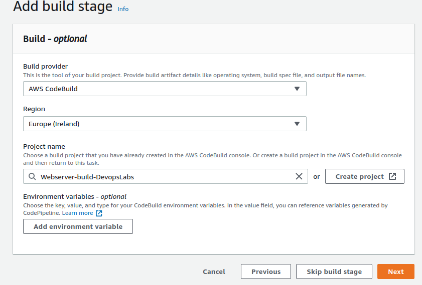

1.6 Em Deploy, vamos selecionar o provider CodeDeploy e nossa aplicação. Clicar em Next.

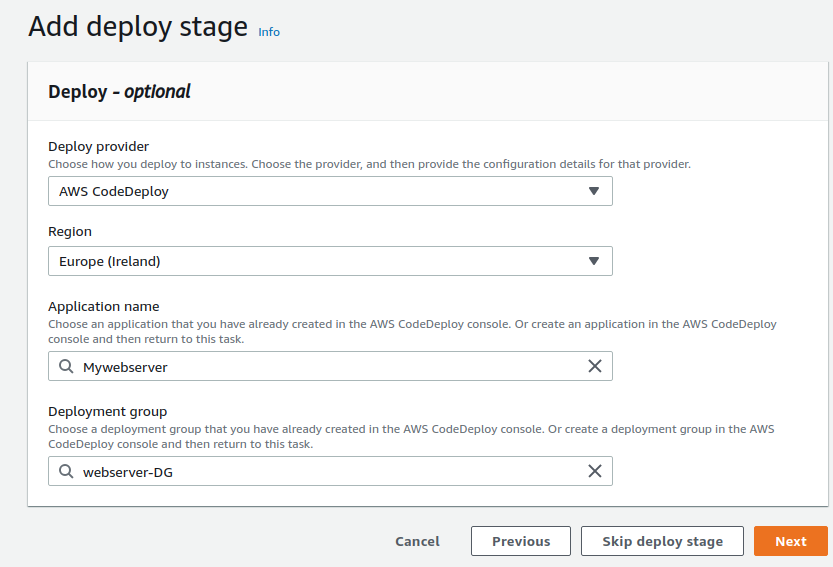

1.7 Em Review, validar se as configurações dos stages estão de acordo e clicar em create pipeline.

1.8 Com isso sua pipeline será inicializada. Com todos os arquivos adicionados corretamentes, a resposta da sua pipeline deverá ser succedded.

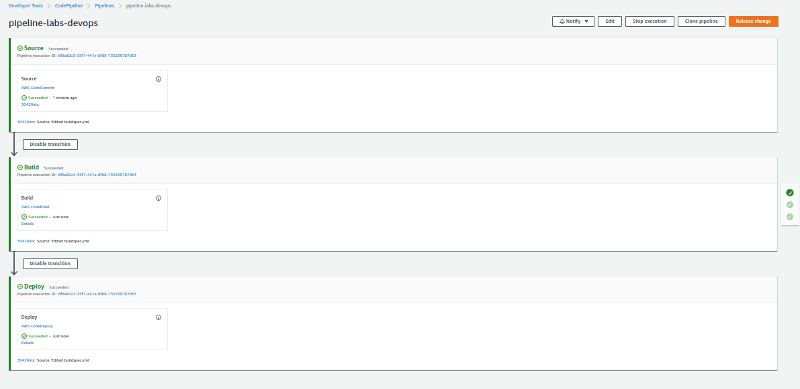

### . Integrando Codepipeline e Slack com Lambda, CloudWatch e SNS.

2.1 Agora vamos integrar a pipeline com o Slack, para que toda execução da pipeline, ela nos notifique no canal qual o status.

2.2 Primeiro passo, se voce ainda não tiver um workspace do slack, criar através deste [Link](https://slack.com/intl/en-br/).

2.3 Canal criado, vamos configurar o slack Webhook. No browser, digitar 
> https://<your-team-domain>.slack.com/apps/manage

2.4 Na Barra de Pesquisa, procure por **Incoming Webhooks** instale  e depois clique em Configuration.

2.5 Selecione o canal ao qual você receberá seus alertas. A saida deverá ser a url do seu WebHook com o token

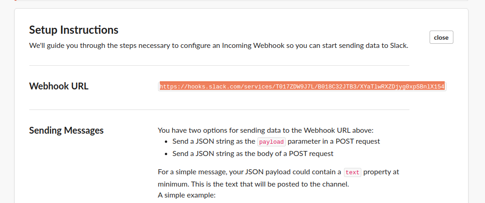

2.6 Agora vamos no Lambda e criar uma função. Para facilitar, recomendo criar a role "slack_alerts_lambda_role".

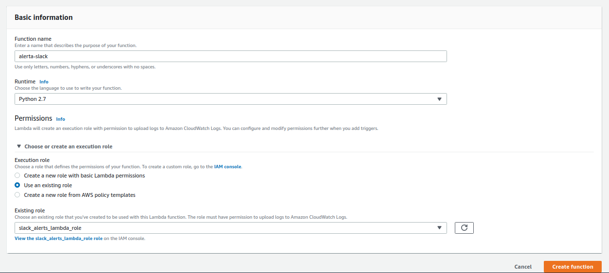

2.7 Adicionar o codigo abaixo ao seu "function code".

~~~python
import json
import logging
import os
from urllib2 import Request, urlopen, URLError, HTTPError
# Read environment variables
SLACK_WEBHOOK_URL = os.environ['SLACK_WEBHOOK_URL']
SLACK_CHANNEL = os.environ['SLACK_CHANNEL']
SLACK_USER = os.environ['SLACK_USER']
logger = logging.getLogger()
logger.setLevel(logging.INFO)
def lambda_handler(event, context):
    logger.info("Event: " + str(event))
    # Read message posted on SNS Topic
    message = json.loads(event['Records'][0]['Sns']['Message'])
    logger.info("Message: " + str(message))
# Construct a slack message
    slack_message = {
        'channel': SLACK_CHANNEL,
        'username': SLACK_USER,
        'text': "%s" % (message)
    }
# Post message on SLACK_WEBHOOK_URL
    req = Request(SLACK_WEBHOOK_URL, json.dumps(slack_message))
    try:
        response = urlopen(req)
        response.read()
        logger.info("Message posted to %s", slack_message['channel'])
    except HTTPError as e:
        logger.error("Request failed: %d %s", e.code, e.reason)
    except URLError as e:
        logger.error("Server connection failed: %s", e.reason)
~~~

Adicione as seguintes variáveis ​​de ambiente baseado na config do seu webhook

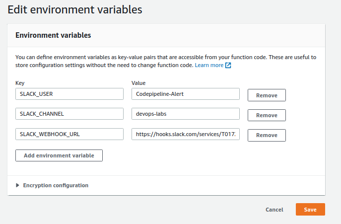

2.8 Salve o lambda e vamos para SNS e crie um topico e clicar em seguida em create subscription.

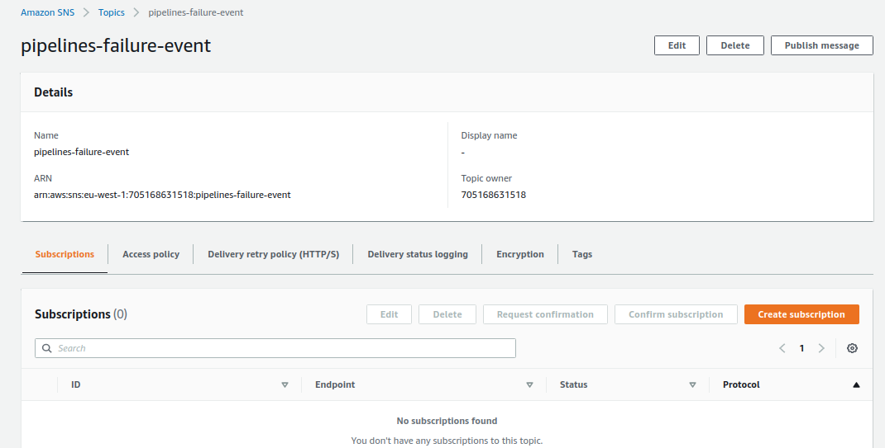

2.9 Selecionar Protocol AWS Lambda e selecionar a função criada ao endpoint. Clicar em Subscription.

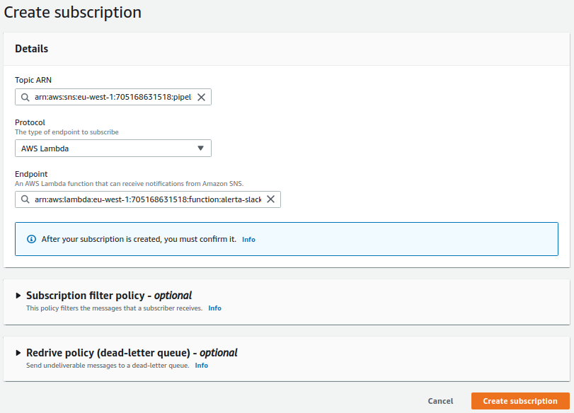

2.10 Agora vamos em CloudWatch clicar em rules > Create Rule.

2.11 Vamos criar um Event para falha da pipeline. Selecionar o serviço "CodePipeline" e EventType "Pipeline execution state change" e especificar o state como Failed. CLicar em Edit JSON e adicionar a pipeline.

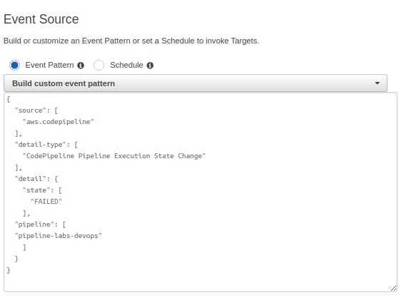

2.12 Agora vamos adicionar o target. Selecionar o serviço SNS topic, e em configure input, selecionar Imput Transformer
~~~
{"pipeline":"$.detail.pipeline"}
~~~
~~~
 ":rotating_light:The Pipeline *<pipeline>* has failed.:rotating_light:"
~~~

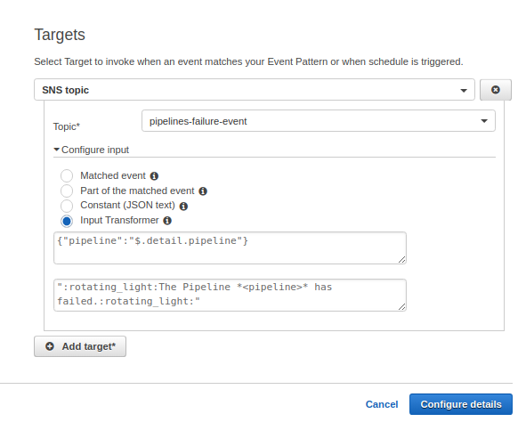

2.13 Clicar em configure details e salve.

2.14 Feito isso basta agora testar sua pipeline forçando a falhar. 

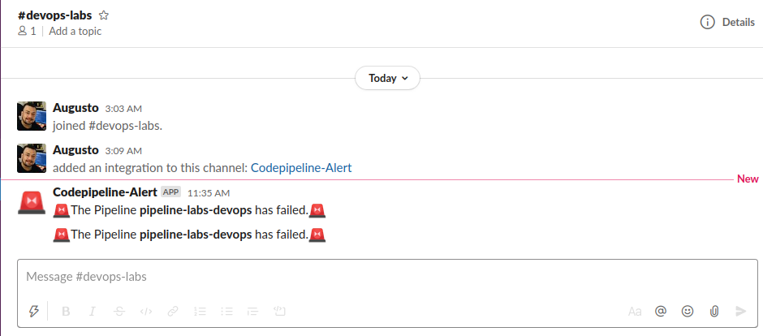

Documentação Referencia:

https://docs.aws.amazon.com/codepipeline/latest/userguide/reference-pipeline-structure.html#action-requirements

https://docs.aws.amazon.com/codepipeline/latest/userguide/best-practices.html#use-cases

https://docs.aws.amazon.com/codepipeline/latest/userguide/actions-invoke-lambda-function.html

https://docs.aws.amazon.com/codepipeline/latest/userguide/actions-create-custom-action.html