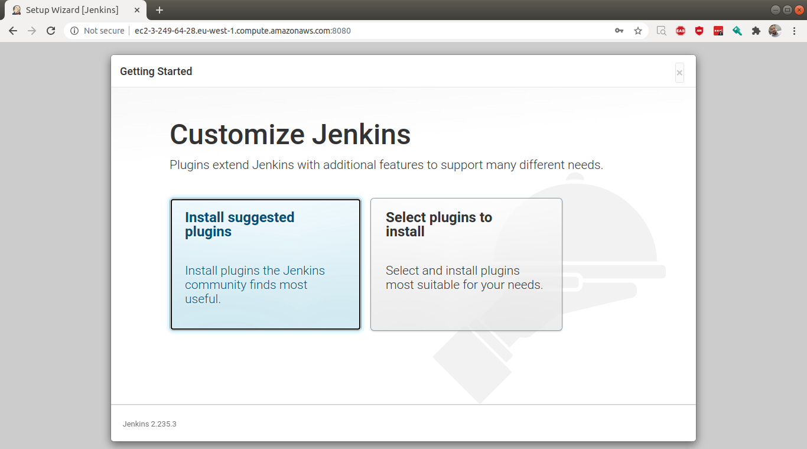
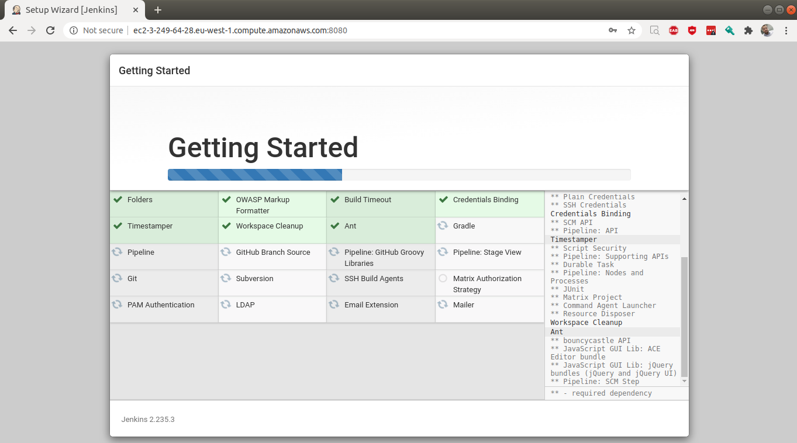
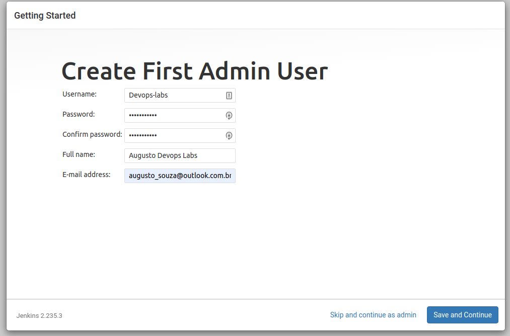
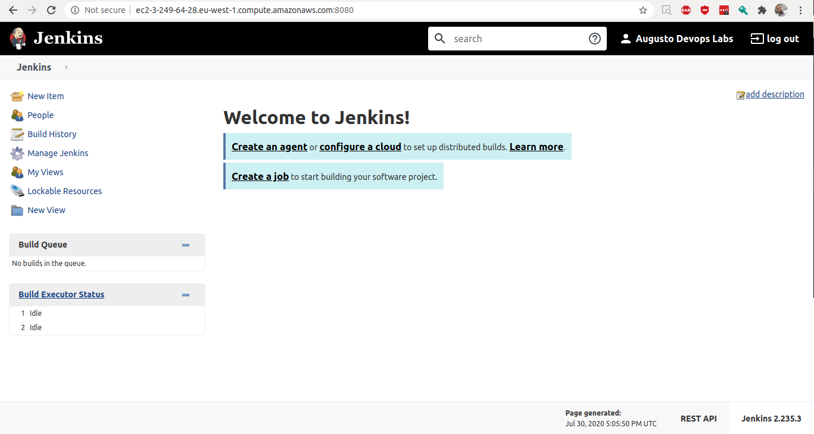

# Lab 05 AWS CodeTools + Jenkins CI

### 1. Instalando Servidor Jenkins

1.1 Criar uma EC2 e no user-data colocar a seguinte configuração

~~~bash
!/bin/bash
sudo yum update -y
sudo wget -O /etc/yum.repos.d/jenkins.repo \
    https://pkg.jenkins.io/redhat/jenkins.repo
sudo rpm --import https://pkg.jenkins.io/redhat/jenkins.io.key
sudo yum upgrade -y
sudo yum install jenkins java-1.8.0-openjdk-devel -yum
sudo service jenkins start
~~~

1.2 Feito isso acessar o servidor e gerar a senha de administrador do Jenkins com o seguinte comando

~~~bash
sudo cat /var/lib/jenkins/secrets/initialAdminPassword
~~~

1.3 Acessar o DNS da EC2 na porta 8080 e colocar a senha gerada. Feito isso, deverá aparecer a seguinte pagina. Clicar em "Install Suggested plugins"

1.4 Com isso o Jenkins irá inciar a instalação dos plugins default, será necessário criar agora seu primeiro usuario do jenkins. Salve continue em seguida finish.

1.5 Pronto, seu Jenkins está pronto para ser usado.

