# Lab 05 Codepipeline + Jenkins CI

Configurando plugins Jenkins integrados com AWS.

### 1. Instalando Servidor Jenkins

1.1 Criar uma EC2 e no user-data colocar a seguinte configuração

~~~bash
!/bin/bash
sudo yum update -y
sudo wget -O /etc/yum.repos.d/jenkins.repo \
    https://pkg.jenkins.io/redhat/jenkins.repo
sudo rpm --import https://pkg.jenkins.io/redhat/jenkins.io.key
sudo yum upgrade -y
sudo yum install jenkins java-1.8.0-openjdk-devel -yum
sudo service jenkins start
~~~

1.2 Feito isso acessar o servidor e gerar a senha de administrador do Jenkins com o seguinte comando

~~~bash
sudo cat /var/lib/jenkins/secrets/initialAdminPassword
~~~

1.3 Acessar o DNS da EC2 na porta 8080 e colocar a senha gerada. Feito isso, deverá aparecer a seguinte pagina. Clicar em "Install Suggested plugins"

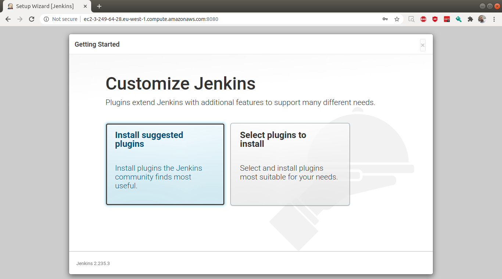

1.4 Com isso o Jenkins irá inciar a instalação dos plugins default, será necessário criar agora seu primeiro usuario do jenkins. Salve continue em seguida finish.

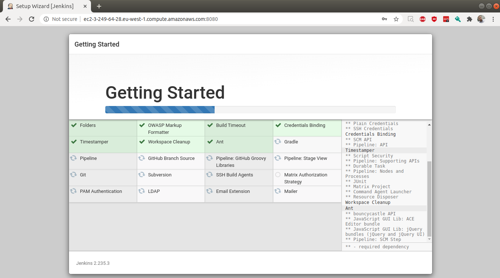

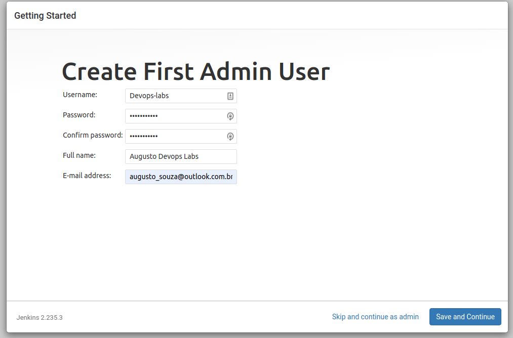

1.5 Pronto, seu Jenkins está pronto para ser usado.

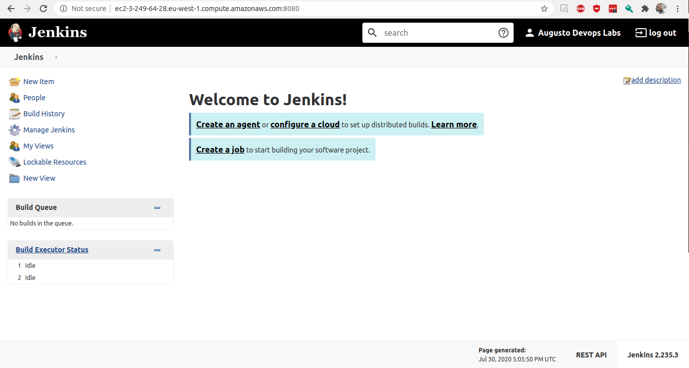

### 2. Configurando plugin Jenkins Amazon EC2

2.1 Primeiro, precisamos criar uma Role para nossa EC2 que permita que o Jenkins possa se comunicar com nossa EC2.

2.2 Vamos em IAM, criaremos uma role com politica de acesso Full a EC2 e anexamos a nossa EC2.

2.3 Voltando, no menu lateral vamos em Manage jenkins e depois em Manage Plugins.

2.4 Agora vamos em available e procuramos por EC2 selecionar o plugin Amazon EC2 e clicar em Install

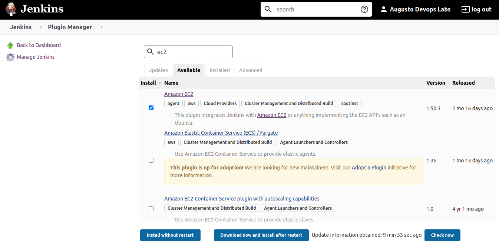

2.5 Instalado, agora vamos configura-lo. No menu lateral, vamos em Manage Jenkins > Manage Nodes and Clouds > Configure Clouds > Add new Cloud > EC2.

2.6 Para essa configuração existe duas maneiras. A primeira, através da criação de um usuario IAM e passar para o Jenkins Key e Secrets. A segunda, que será o nosso caso, será autenticar com o perfil atual da EC2 usando Chave privada. Essa chave é a mesma do arquivo pem gerado ao criar sua EC2. Copiamos a chave e testamos a conexão. A mensagem será "success"

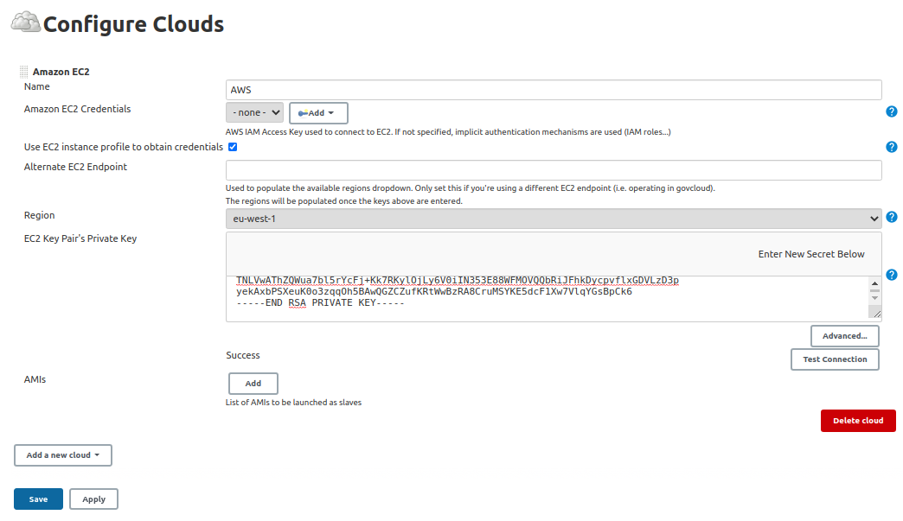

2.7 Agora vamos configurar a AMI do Jenkins Slave baseado nas informações do master. Feito, clicamos em save.

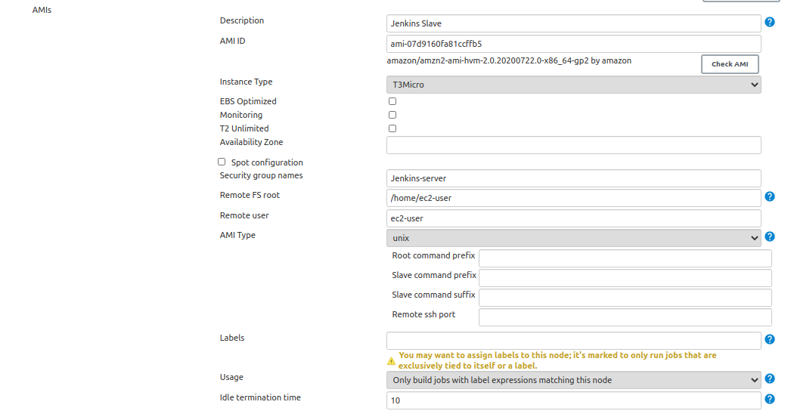

2.8 Agora vamos criar nosso primeiro Job no Jenkins para testar o plugin. Usaremos o Job Free-Style. Vou chama-lo de "teste-plugin" e clicar em ok.

2.9 Agora vamos configurar o Job, primeiro vamos add a "label Expression" que neste caso definimos com AWS. Depois em add build step, vou colocar dois bash commands para iniciar o job. Feito, clicar em Save.

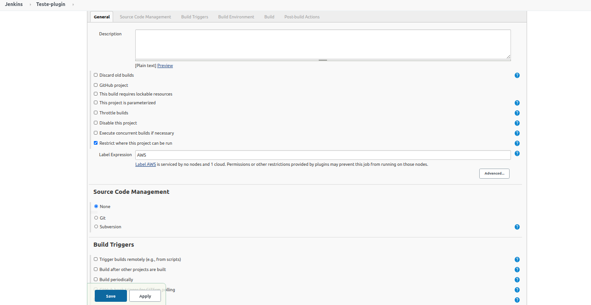
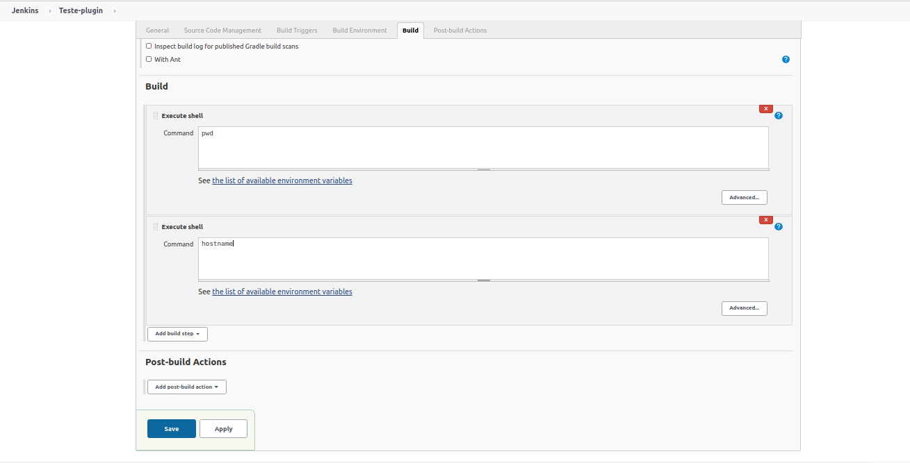

2.10 Agora podemos ver que o Job foi iniciado, e no dashboard do EC2 podemos ver que uma nova instancia foi inicializada. 

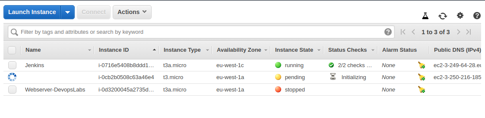

2.11 Novamente em  Manage Jenkins > Manage Nodes and Clouds podemos ver que agora temos um slave, que conforme configuramos, permanecerá disponivel por 10 minutos ocioso.

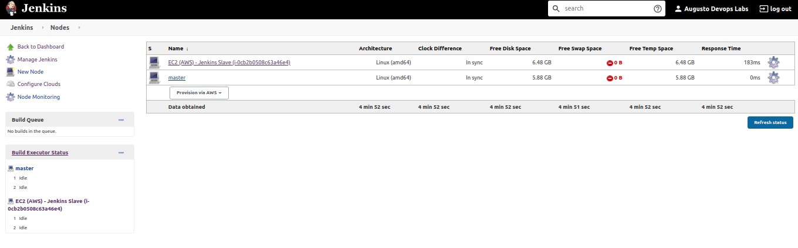

2.12 Em console Output conseguimos ver os comandos que definimos no build se foram executados com sucesso. E ai estão

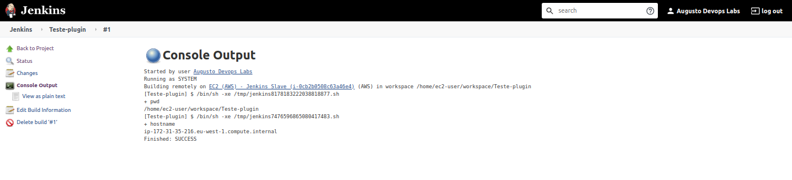

### 3. Integrando o Jenkins com Codepipeline

3.1 Primeiro, precisamos criar uma Role para nossa EC2 que permita que o Jenkins integrar com o Codepipeline. Podemos usar a mesma role do lab anterior e adicionar a policy "AWSCodePipelineCustomActionAccess"

3.2 Agora no Jenkins, vamos em Manage Jenkins > Manage Plugins. Instale o Plugin **AWS CodePipeline**. Na tela de instalação, marcar o Jenkins para restart para concluir instalação.

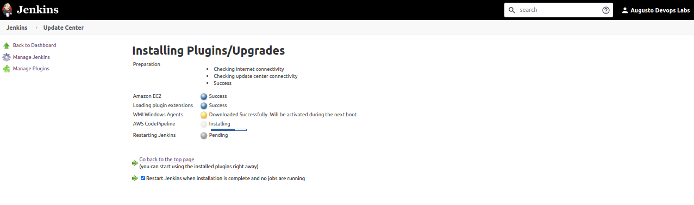

3.3 No Dashboard do Jenkins, criar um novo item e selecionar FreeStyle. Clicar em OK

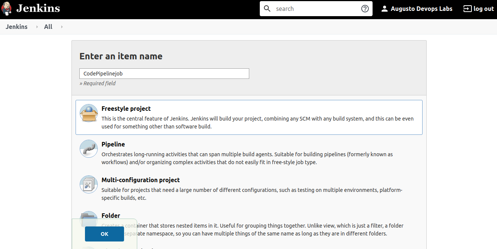

3.4 Em General, selecionar a opção "Execute concurrent builds if necessary" e clicar em avançado

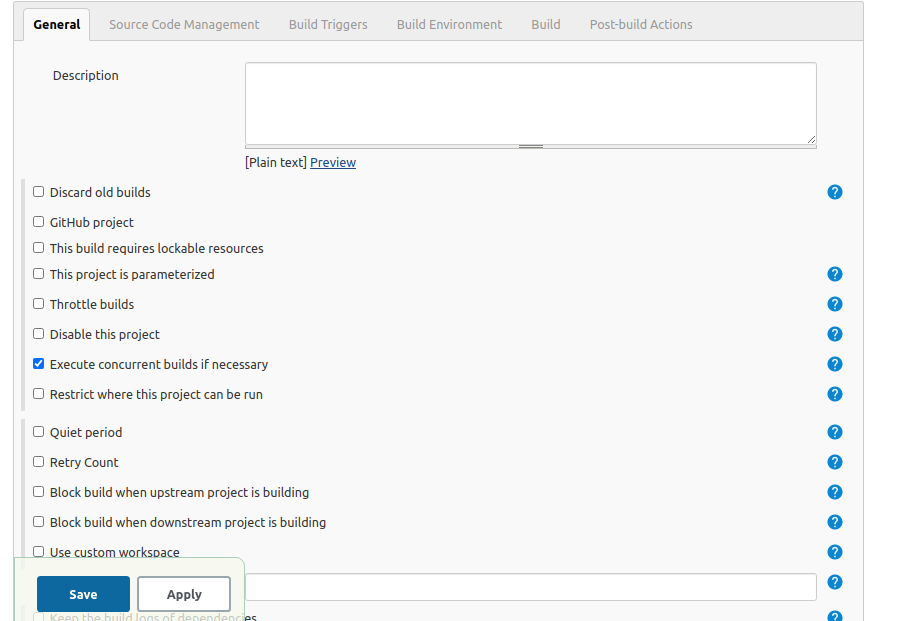

3.5 Em Source Code Management selecionar AWS CodePipeline, e escolher a região onde está contruido sua pipeline. Em credenciais há duas opções ou configurar diretamente na EC2 ou passar a credencial na config. Para agilizar, vamos passar aqui na config.

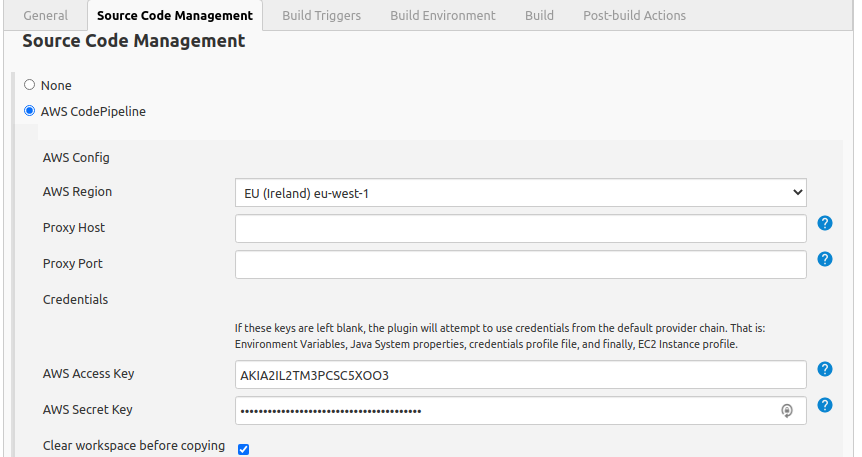

3.6 Ainda em Source Code Management, definir a categoria test e dar um nome pro provider(Esse nome deverá ser o meso na pipeline)

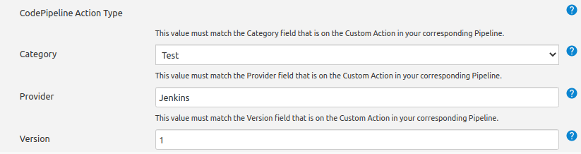

3.7 Em build Triggers, desmarcar todos os campos e deixar Poll SCM. Em Schedule adicionar 5 * com  espaço entre eles.

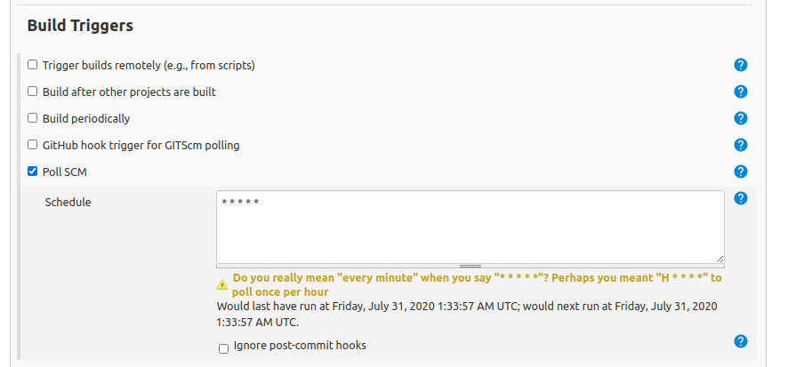

3.8 Em Build clique em "add build step" e selecionar shell. Adicionar "rake". Em Post-build Action, "add post-build action" e deixar em branco. Clicar em Save

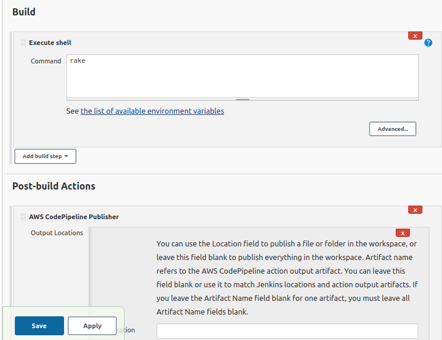

3.9 Agora voltado ao Codepipeline, na pipeline, clicar em Edit. então, vamos em build > edit stage > Add Action Group. em Edit Action, vamos adicionar as seguintes informações. Action Name (ex: test), Action Provider (Add Jenkins), Impult Artifacts (buildArtifact), Provider name (O mesmo do Jenkins), Server URL (DNS da EC2), Project Name (O mesmo do Jenkins). Então, clique em "Done"

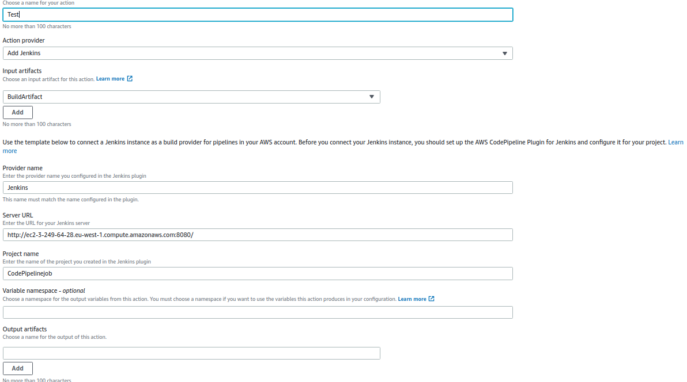

3.10 Salve a edição da pipeline e depois clique em "Release Change"

Documentação Referencia

* https://docs.aws.amazon.com/pt_br/codepipeline/latest/userguide/tutorials-four-stage-pipeline.html

* https://plugins.jenkins.io/aws-codepipeline/

* https://plugins.jenkins.io/ec2/

