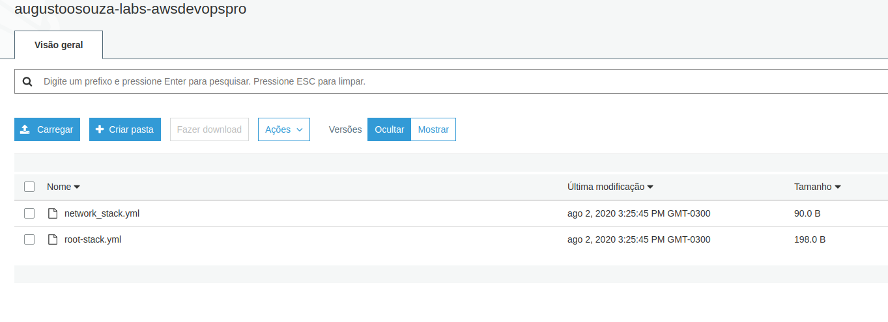
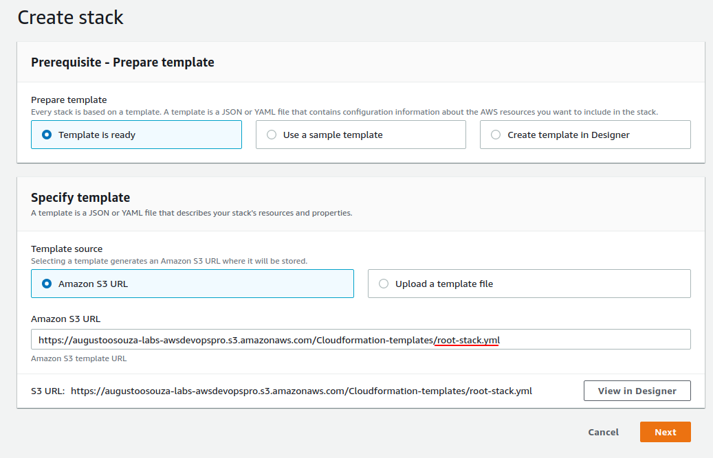
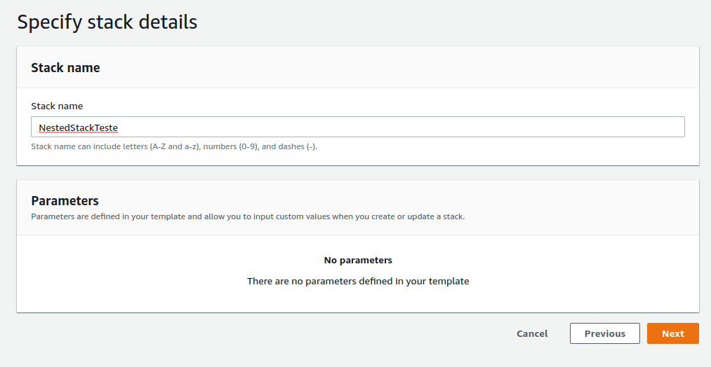
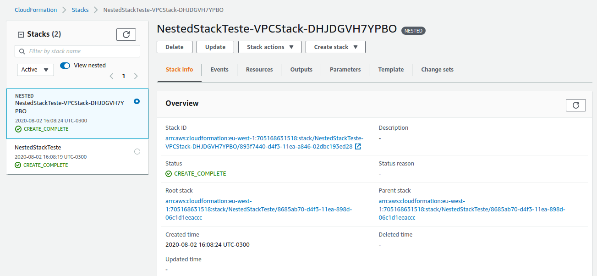

# Lab 06 CloudFormation

Criando stacks com CLoudFormation.

### 1. Modelo Simplificado CloudFormation

1.1 Primeiro passo para entender o funcionamento do CloudFormation, é criar um modelo simplificado. Esse modelo abaixo cria o mesmo servidor web usado nos laboratorios anteriores.

~~~yaml
AWSTemplateFormatVersion: 2010-09-09
Description: "Modelo Simplicaficado CloudFormation Devops Labs"

Resources:
  WebInstance:
    Type: "AWS::EC2::Instance"
    Properties:
      KeyName: Augusto-Devopslabs
      ImageId: ami-07d9160fa81ccffb5
      InstanceType: t3a.micro
      SecurityGroups:
        - Ref: HTTPSecurityGroup
        - Ref: SSHSecurityGroup
      UserData: 
        Fn::Base64: 
          !Sub |
            #!/bin/bash -xe
            yum update -y
            yum install httpd -y
            service httpd start
            chkconfig httpd on
            echo "Web Server Devops-Labs" > /var/www/html/index.html   
      Tags:
        - Key: Name
          Value: WebInstance
        - Key: Projeto
          Value: Devops-Labs

  EIP:
    Type: "AWS::EC2::EIP"
    Properties:
      InstanceId: 
        Ref: WebInstance

  HTTPSecurityGroup:
    Type: "AWS::EC2::SecurityGroup"
    Properties:
      GroupDescription: HTTP security group
      SecurityGroupIngress:
        - IpProtocol: tcp
          FromPort: 80
          ToPort: 80
          CidrIp: 0.0.0.0/0
      Tags:
        - Key: Name
          Value: SG-WebServerHTTP
        - Key: Projeto
          Value: Devops-Labs

  SSHSecurityGroup:
    Type: "AWS::EC2::SecurityGroup"
    Properties:
      GroupDescription: SSH security group
      SecurityGroupIngress:
        - IpProtocol: tcp
          FromPort: 22
          ToPort: 22
          CidrIp: 0.0.0.0/0
      Tags:
        - Key: Name
          Value: SG-WebServerSSH
        - Key: Projeto
          Value: Devops-Labs
~~~

### 2. Trabalhando com Nested Stack.

2.1 Criar um Bucket S3 que centralizará nossos modelos.

~~~shell
$ aws s3api create-bucket --bucket-name augustoosouza-labs-awsdevopspro --region eu-west-2 --create-bucket-configuration LocationConstraint=eu-west-2 --region eu-west-2
~~~

2.2 Uma boa estrategia é versionar os seus templates, para isso, habilite o versionamento no seu bucket. (Opcional)

~~~shell
$ aws--region eu-west-3 s3api put-bucket-versioning --bucket augustoosouza-labs-awsdevopspro --versioning-configuration Status=Enabled
~~~

2.3 Agora vamos criar o primeiro template. Vamos dar o nome de root_stack. 

~~~yaml
Resources:
  VPCStack:
    Type: AWS::CloudFormation::Stack
    Properties:
      TemplateURL: 'https://augustoosouza-labs-awsdevopspro.s3.amazonaws.com/Cloudformation-templates/network_stack.yml'
~~~

2.4 Observe que, no primeiro template, em "properties" apontamos para uma URL que faz referencia a um template. Vamos criar este segundo template e vamos chama-lo de Network stack:

~~~yaml
Resources:
  VPC:
    Type: 'AWS::EC2::VPC'
    Properties:
      CidrBlock: 172.0.0.0/16
~~~

2.5 Agora vamos mover estes templates para o bucket S3. 

outra opção de envio é via CLI.

~~~shell
$ aws --região eu-west-3 s3 cp network-stack.yml s3: // augustoosouza-labs-awsdevopspro 
upload: ./network-stack.yml para s3: // augustoosouza-labs-awsdevopspro / network-stack.yml
~~~

2.6 Vamos validar nosso "nested stack". Em https://console.aws.amazon.com/cloudformation > Create Stack. em "Template Source", vamos apontar para a URL do nosso root-template. clicar em Next.

2.7 Vamos dar um nome para nossa Stack. e Depois avançar até create stack.

2.8 E assim, teremos nossa "Nested Stack". Lembre-se que, para deletar a Nested Stack, deveremos deletar a root stack.

### 3. Passando parametros para sua Nested Stack.

3.1 Vamos definir valores que que podem ser globais através de parametros. Primeiro na Stack Root, vamos adicionar o bloco VPCCIDRBlock

~~~yaml
Parameters:
  VPCCIDRBlock:
    Description: VPC CidrBlock
    Type: String
    Default: 172.0.0.0/16

Resources:
  VPCStack:
    Type: AWS::CloudFormation::Stack
    Properties:
      TemplateURL: 'https://augustoosouza-labs-awsdevopspro.s3.amazonaws.com/Cloudformation-templates/network_stack.yml'
      Parameters:
        VPCCIDRBlock: !Ref VPCCIDRBlock
~~~

3.2 Agora no template network, vamos adiconar o resource VPC.

~~~yaml
Parameters:
  VPCCIDRBlock:
    Description: VPC CidrBlock
    Type: String
Resources:
  VPC:
    Type: 'AWS::EC2::VPC'
    Properties:
      CidrBlock: !Ref VPCCIDRBlock
~~~

3.3 Agora, nossos templates ganharam corpo de Nested Stack, onde no root, passamos parametros para as demais stacks. Basta agora enviar os templates atualizados para o S3. Um recurso muito legal é através do CLI usando o comando [package](https://docs.aws.amazon.com/cli/latest/reference/cloudformation/package.html).

~~~shell
aws cloudformation package --template-file root-stack.json --output-template packed-nested-stacks.yml --s3-bucket augustoosouza-labs-awsdevopspro  --region eu-west-2
~~~

### 3. Usando outputs em sua Nested Stack.

3.1 Vamos trabalhar agora usando outputs através da função [fn::getAtt](https://docs.aws.amazon.com/pt_br/AWSCloudFormation/latest/UserGuide/intrinsic-function-reference-getatt.html). Para isso, vamos adicionar uma terceira stack que será o nosso SecurityGroup.

3.2 Primeiro, vamos adicionar o output que queremos na network-stack. Esse output será o ID da VPC.

~~~yaml
Parameters:
  VPCCIDRBlock:
    Description: VPC CidrBlock
    Type: String
Resources:
  VPC:
    Type: 'AWS::EC2::VPC'
    Properties:
      CidrBlock: !Ref VPCCIDRBlock

Outputs:
  VPCID:
    Description: "ID da VPC"
    Value: !Ref VPC
~~~

3.3 Agora criamos a stack do SecurityGroup usando o output "VPC ID"

~~~yaml
Parameters:
  VPCID:
    Description: VPC ID
    Type: String

Resources:
  SecurityGroup:
    Type: 'AWS::EC2::SecurityGroup'
    Properties:
      GroupDescription: Security Group Webserver
      VpcId:
        Ref: VPCID
      SecurityGroupIngress:
        - Description: Permitir HTTP
          IpProtocol: tcp
          FromPort: 80
          ToPort: 80
          CidrIp: 0.0.0.0/0
        - Description: permitir SSH
          IpProtocol: tcp
          FromPort: 22
          ToPort: 22
          CidrIp: 0.0.0.0/0
~~~
