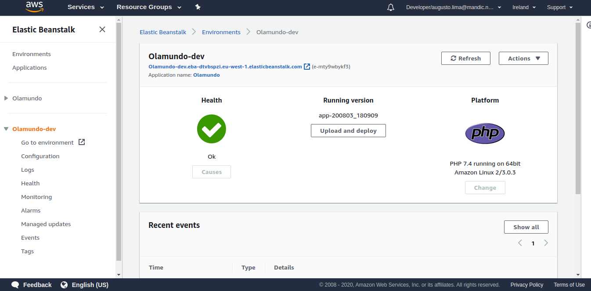
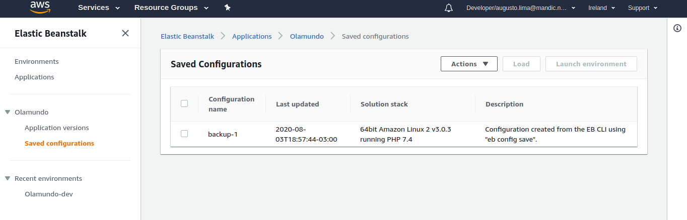

# Lab 07 - Elastic Beanstalk

Criando projetos com Elastic Beanstalk

### 1. Criando projeto usando EBCLI

1.1 Pré Requisito para instalar o EB cli é ter o Python-pip instalado. Para instalar o EBCLI rodar o seguinte comando.

~~~bash
$ pip install awsebcli --upgrade --user
~~~

1.2 Feito validamos a instalação

~~~bash
$ eb --version
EB CLI 3.18.1 (Python 2.7.1)
~~~

1.3 Agora crie um diretorio para seu projeto onde o eb será inicializado, conforme exemplo

~~~bash
.
└── Olamundo
    └── index.html

1 directory, 1 file
~~~

1.4 Agora rodamos o comando "eb init" no diretorio do projeto e passamos os parametros.

~~~bash
$ eb init

Select a default region
1) us-east-1 : US East (N. Virginia)
2) us-west-1 : US West (N. California)
3) us-west-2 : US West (Oregon)
4) eu-west-1 : EU (Ireland)
5) eu-central-1 : EU (Frankfurt)
6) ap-south-1 : Asia Pacific (Mumbai)
7) ap-southeast-1 : Asia Pacific (Singapore)
8) ap-southeast-2 : Asia Pacific (Sydney)
9) ap-northeast-1 : Asia Pacific (Tokyo)
10) ap-northeast-2 : Asia Pacific (Seoul)
11) sa-east-1 : South America (Sao Paulo)
12) cn-north-1 : China (Beijing)
13) cn-northwest-1 : China (Ningxia)
14) us-east-2 : US East (Ohio)
15) ca-central-1 : Canada (Central)
16) eu-west-2 : EU (London)
17) eu-west-3 : EU (Paris)
18) eu-north-1 : EU (Stockholm)
19) eu-south-1 : EU (Milano)
20) ap-east-1 : Asia Pacific (Hong Kong)
21) me-south-1 : Middle East (Bahrain)
22) af-south-1 : Africa (Cape Town)
(default is 3): 4

Select an application to use
1) [ Create new Application ]
(default is 1): 1

Enter Application Name
(default is "Olamundo"): 
Application Olamundo has been created.

It appears you are using PHP. Is this correct?
(Y/n): y
Select a platform branch.
1) PHP 7.4 running on 64bit Amazon Linux 2
2) PHP 7.3 running on 64bit Amazon Linux 2
3) PHP 7.2 running on 64bit Amazon Linux 2
4) PHP 7.3 running on 64bit Amazon Linux
5) PHP 7.2 running on 64bit Amazon Linux
6) PHP 7.1 running on 64bit Amazon Linux (Deprecated)
7) PHP 7.0 running on 64bit Amazon Linux (Deprecated)
8) PHP 5.6 running on 64bit Amazon Linux (Deprecated)
9) PHP 5.5 running on 64bit Amazon Linux (Deprecated)
10) PHP 5.4 running on 64bit Amazon Linux (Deprecated)
(default is 1): 1

Cannot setup CodeCommit because there is no Source Control setup, continuing with initialization
Do you want to set up SSH for your instances?
(Y/n): y

Select a keypair.
1) Augusto-Devopslabs
2) [ Create new KeyPair ]
(default is 1): 1

~~~

1.5 Agora vamos criar nosso environment.

~~~bash
$ eb create Olamundo-dev
~~~

1.6 Voce pode acompanhar no proprio CLI os eventos de criação do ambiente

~~~bash
Creating application version archive "app-200803_180909".
Uploading Olamundo/app-200803_180909.zip to S3. This may take a while.
Upload Complete.
Environment details for: Olamundo-dev
  Application name: Olamundo
  Region: eu-west-1
  Deployed Version: app-200803_180909
  Environment ID: e-mty9wbykf3
  Platform: arn:aws:elasticbeanstalk:eu-west-1::platform/PHP 7.4 running on 64bit Amazon Linux 2/3.0.3
  Tier: WebServer-Standard-1.0
  CNAME: UNKNOWN
  Updated: 2020-08-03 21:09:32.802000+00:00
Printing Status:
2020-08-03 21:09:31    INFO    createEnvironment is starting.
2020-08-03 21:09:32    INFO    Using elasticbeanstalk-eu-west-1-705168631518 as Amazon S3 storage bucket for environment data.
2020-08-03 21:09:52    INFO    Created security group named: sg-049fd5d8b5bf190c7
2020-08-03 21:09:53    INFO    Created load balancer named: awseb-e-m-AWSEBLoa-1TCY42THZIQAI
2020-08-03 21:10:09    INFO    Created security group named: awseb-e-mty9wbykf3-stack-AWSEBSecurityGroup-1SA1PI2P5RTQ1
2020-08-03 21:10:09    INFO    Created Auto Scaling launch configuration named: awseb-e-mty9wbykf3-stack-AWSEBAutoScalingLaunchConfiguration-J8IPQ2JIG1VF
2020-08-03 21:11:12    INFO    Created Auto Scaling group named: awseb-e-mty9wbykf3-stack-AWSEBAutoScalingGroup-15PP69X7KY7Q2
2020-08-03 21:11:13    INFO    Waiting for EC2 instances to launch. This may take a few minutes.
2020-08-03 21:11:13    INFO    Created Auto Scaling group policy named: arn:aws:autoscaling:eu-west-1:705168631518:scalingPolicy:5513a4e3-a6ae-4beb-8301-406748d10eea:autoScalingGroupName/awseb-e-mty9wbykf3-stack-AWSEBAutoScalingGroup-15PP69X7KY7Q2:policyName/awseb-e-mty9wbykf3-stack-AWSEBAutoScalingScaleDownPolicy-11WXNIDL5TDHG
2020-08-03 21:11:13    INFO    Created Auto Scaling group policy named: arn:aws:autoscaling:eu-west-1:705168631518:scalingPolicy:b31cf28d-1677-44b4-ad95-050e995acb6e:autoScalingGroupName/awseb-e-mty9wbykf3-stack-AWSEBAutoScalingGroup-15PP69X7KY7Q2:policyName/awseb-e-mty9wbykf3-stack-AWSEBAutoScalingScaleUpPolicy-J44ZX7HJC8CJ
2020-08-03 21:11:13    INFO    Created CloudWatch alarm named: awseb-e-mty9wbykf3-stack-AWSEBCloudwatchAlarmLow-M2QBS7SRMWVB
2020-08-03 21:11:13    INFO    Created CloudWatch alarm named: awseb-e-mty9wbykf3-stack-AWSEBCloudwatchAlarmHigh-DMGVP638DC8
 -- Events -- (safe to Ctrl+C)
~~~

1.7 Pronto, ambiente criado com sucesso no beanstalk. 

1.8 voltando no diretório, podemos ver que foi criado um novo diretorio chamado .elasticbeanstalk e vamos nos aprofundar mais nele.

~~~bash
Olamundo
    ├── .elasticbeanstalk
    │   └── config.yml
    ├── .gitignore
    └── index.html
~~~

1.9 Em Config.yml estão as configurações do seu ambiente criado. Nem todas as configurações aparecem ai. O que é considerado default pela AWS, não está neste arquivo.

~~~yaml
branch-defaults:
  default:
    environment: Olamundo-dev
    group_suffix: null
global:
  application_name: Olamundo
  branch: null
  default_ec2_keyname: Augusto-Devopslabs
  default_platform: PHP 7.4 running on 64bit Amazon Linux 2
  default_region: eu-west-1
  include_git_submodules: true
  instance_profile: null
  platform_name: null
  platform_version: null
  profile: null
  repository: null
  sc: null
  workspace_type: Application
~~~
### 2. Fazendo backup das configurações do Elastic Beanstalk

2.1 Para fazer backup da configuração do beanstalk basta digitar comando

~~~bash
$ eb config save Olamundo-dev --cfg backup-1

Configuration saved at: /home/augustoosouza/beanstalk-devopspro/Olamundo/.elasticbeanstalk/saved_configs/backup-1.cfg.yml
~~~ 

2.2 dentro de .elasticbeanstalk/saved_config estará nosso arquivo de backup. Este arquivo contem informações mais completas do ambiente e através dele conseguimos personalizar nosso ambiente.

~~~yaml
EnvironmentConfigurationMetadata:
  Description: Configuration created from the EB CLI using "eb config save".
  DateCreated: '1596491864000'
  DateModified: '1596491864000'
Platform:
  PlatformArn: arn:aws:elasticbeanstalk:eu-west-1::platform/PHP 7.4 running on 64bit Amazon Linux 2/3.0.3
OptionSettings:
  aws:elasticbeanstalk:command:
    BatchSize: '30'
    BatchSizeType: Percentage
  aws:elb:policies:
    ConnectionDrainingEnabled: true
  aws:elb:loadbalancer:
    CrossZone: true
  aws:elasticbeanstalk:environment:
    ServiceRole: aws-elasticbeanstalk-service-role
  aws:elasticbeanstalk:healthreporting:system:
    SystemType: enhanced
  aws:autoscaling:launchconfiguration:
    IamInstanceProfile: aws-elasticbeanstalk-ec2-role
    EC2KeyName: Augusto-Devopslabs
  aws:autoscaling:updatepolicy:rollingupdate:
    RollingUpdateType: Health
    RollingUpdateEnabled: true
 

EnvironmentTier:
  Type: Standard
  Name: WebServer
AWSConfigurationTemplateVersion: 1.1.0.0
~~~

2.3 Essa configuração salva pode ser vizualizada tambem na console.

2.4 Na configuração que salva, vamos adicionar uma configuração de AutoScaling para testar.

~~~yaml
 AWSEBAutoScalingScaleUpPolicy.aws:autoscaling:trigger:
    UpperBreachScaleIncrement: '2'
  AWSEBCloudwatchAlarmLow.aws.autoscaling:trigger:
    LowerThreshold: '20'
    MeasureName: CPUUtilization
    Unit: Percent
   AWSEBCloudwatchAlarmHigh.aws.autoscaling:trigger:
    LowerThreshold: '50'
~~~

2.4 Agora vamos gravar essa alteração

~~~shell
$ eb config put backup-1
~~~

2.5 Em Seguida, vamos atualizar nosso ambiente com o comando

~~~shell
$ eb deploy
~~~

